# IB ACIO AI Preparation System - Software Architecture

## 📋 TABLE OF CONTENTS
1. [System Overview](#system-overview)
2. [High-Level Architecture](#high-level-architecture)
3. [Component Architecture](#component-architecture)
4. [Database Design](#database-design)
5. [API Architecture](#api-architecture)
6. [Frontend Architecture](#frontend-architecture)
7. [Backend Architecture](#backend-architecture)
8. [Security Architecture](#security-architecture)
9. [Integration Architecture](#integration-architecture)
10. [Deployment Architecture](#deployment-architecture)
11. [Performance Architecture](#performance-architecture)
12. [Technology Stack](#technology-stack)
13. [Data Flow Diagrams](#data-flow-diagrams)
14. [Scalability Considerations](#scalability-considerations)

---

## 🎯 SYSTEM OVERVIEW

### Business Context
- **Domain**: Educational Technology (EdTech)
- **Purpose**: AI-powered exam preparation system for IB ACIO Grade II/Executive
- **Users**: Individual exam candidates (primarily mobile users)
- **Scale**: Single-user MVP with multi-user scalability design
- **Timeline**: 30-day rapid development and deployment

### System Characteristics
- **Type**: Progressive Web Application (PWA)
- **Architecture Pattern**: Microservices-ready Monolith
- **Deployment**: Cloud-first with offline capabilities
- **Data Strategy**: Local-first with cloud sync
- **AI Integration**: External API-driven with local caching

---

## 🏗 HIGH-LEVEL ARCHITECTURE

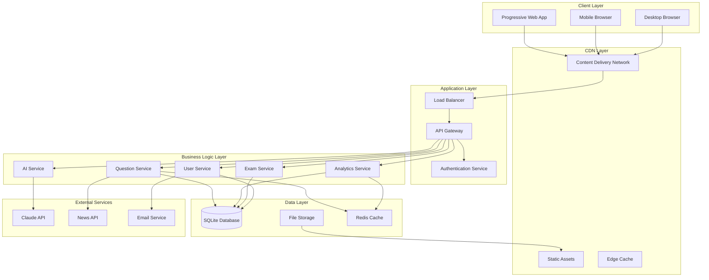

---

## 🧩 COMPONENT ARCHITECTURE

### Core System Components

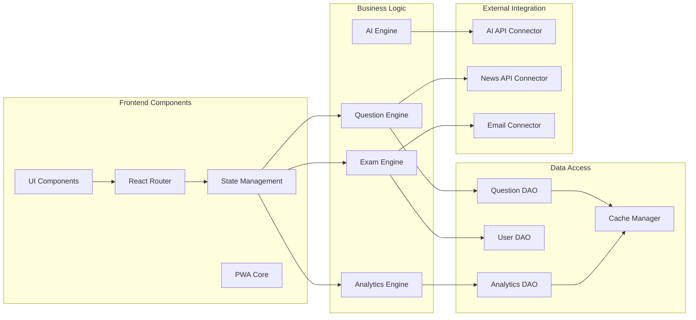

### Component Responsibilities

#### Frontend Components
- **UI Components**: Reusable React components with Tailwind CSS
- **React Router**: SPA navigation and route management
- **State Management**: Zustand/Redux for global state
- **PWA Core**: Service worker, offline storage, push notifications

#### Business Logic Components
- **Question Engine**: Question generation, categorization, difficulty analysis
- **Analytics Engine**: Performance analysis, pattern recognition, recommendations
- **Exam Engine**: Test simulation, scoring, timing, attempt management
- **AI Engine**: AI API orchestration, prompt engineering, response processing

#### Data Access Components
- **DAOs**: Data Access Objects for each entity type
- **Cache Manager**: Intelligent caching strategy for performance
- **Migration Manager**: Database schema evolution

---

## 🗃 DATABASE DESIGN

### Entity Relationship Diagram

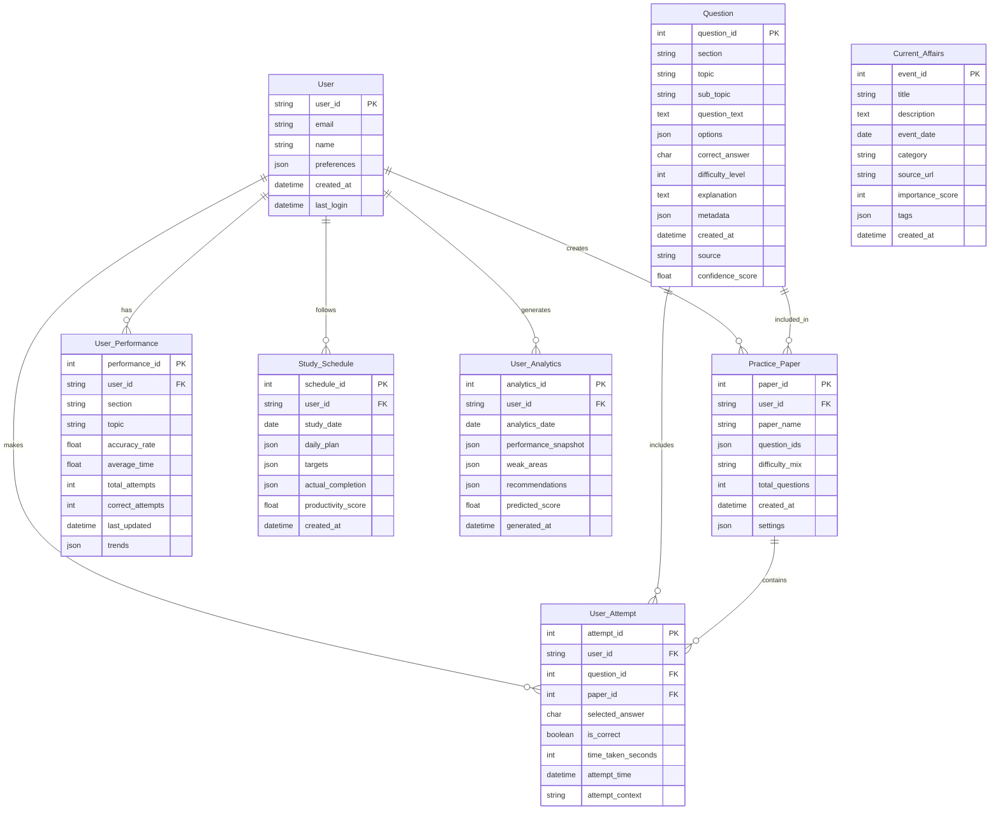

### Database Schema Implementation

```sql
-- Users table
CREATE TABLE users (
    user_id TEXT PRIMARY KEY,
    email TEXT UNIQUE NOT NULL,
    name TEXT NOT NULL,
    preferences JSON DEFAULT '{}',
    created_at DATETIME DEFAULT CURRENT_TIMESTAMP,
    last_login DATETIME DEFAULT CURRENT_TIMESTAMP,
    profile_data JSON DEFAULT '{}'
);

-- Questions table with comprehensive metadata
CREATE TABLE questions (
    question_id INTEGER PRIMARY KEY AUTOINCREMENT,
    section TEXT NOT NULL CHECK (section IN ('current_affairs', 'general_studies', 'numerical_aptitude', 'reasoning', 'english')),
    topic TEXT NOT NULL,
    sub_topic TEXT,
    question_text TEXT NOT NULL,
    options JSON NOT NULL, -- {"A": "option1", "B": "option2", "C": "option3", "D": "option4"}
    correct_answer TEXT NOT NULL CHECK (correct_answer IN ('A', 'B', 'C', 'D')),
    difficulty_level INTEGER CHECK (difficulty_level BETWEEN 1 AND 5),
    explanation TEXT,
    metadata JSON DEFAULT '{}', -- Additional question metadata
    created_at DATETIME DEFAULT CURRENT_TIMESTAMP,
    source TEXT DEFAULT 'ai_generated',
    confidence_score REAL DEFAULT 0.8,
    tags JSON DEFAULT '[]',
    estimated_time_seconds INTEGER DEFAULT 60,
    year_pattern INTEGER, -- Historical year appearance
    frequency_score REAL DEFAULT 0.0 -- How often this type appears
);

-- Practice papers
CREATE TABLE practice_papers (
    paper_id INTEGER PRIMARY KEY AUTOINCREMENT,
    user_id TEXT NOT NULL,
    paper_name TEXT NOT NULL,
    question_ids JSON NOT NULL, -- Array of question IDs [1,2,3,...]
    difficulty_mix TEXT DEFAULT 'balanced', -- easy/medium/hard distribution
    total_questions INTEGER DEFAULT 100,
    sections_config JSON DEFAULT '{}', -- Section-wise configuration
    created_at DATETIME DEFAULT CURRENT_TIMESTAMP,
    settings JSON DEFAULT '{}', -- Timer, negative marking, etc.
    is_completed BOOLEAN DEFAULT FALSE,
    completion_date DATETIME,
    FOREIGN KEY (user_id) REFERENCES users(user_id)
);

-- User attempts with detailed tracking
CREATE TABLE user_attempts (
    attempt_id INTEGER PRIMARY KEY AUTOINCREMENT,
    user_id TEXT NOT NULL,
    question_id INTEGER NOT NULL,
    paper_id INTEGER,
    selected_answer TEXT CHECK (selected_answer IN ('A', 'B', 'C', 'D', 'SKIPPED')),
    is_correct BOOLEAN,
    time_taken_seconds INTEGER,
    attempt_time DATETIME DEFAULT CURRENT_TIMESTAMP,
    attempt_context TEXT DEFAULT 'practice', -- practice/mock/revision
    confidence_level INTEGER CHECK (confidence_level BETWEEN 1 AND 5),
    review_status TEXT DEFAULT 'not_reviewed',
    FOREIGN KEY (user_id) REFERENCES users(user_id),
    FOREIGN KEY (question_id) REFERENCES questions(question_id),
    FOREIGN KEY (paper_id) REFERENCES practice_papers(paper_id)
);

-- User performance analytics
CREATE TABLE user_performance (
    performance_id INTEGER PRIMARY KEY AUTOINCREMENT,
    user_id TEXT NOT NULL,
    section TEXT NOT NULL,
    topic TEXT,
    accuracy_rate REAL DEFAULT 0.0,
    average_time_seconds REAL DEFAULT 0.0,
    total_attempts INTEGER DEFAULT 0,
    correct_attempts INTEGER DEFAULT 0,
    last_updated DATETIME DEFAULT CURRENT_TIMESTAMP,
    trends JSON DEFAULT '{}', -- Historical performance trends
    strength_level TEXT DEFAULT 'unknown', -- weak/average/strong
    FOREIGN KEY (user_id) REFERENCES users(user_id)
);

-- Current affairs events
CREATE TABLE current_affairs (
    event_id INTEGER PRIMARY KEY AUTOINCREMENT,
    title TEXT NOT NULL,
    description TEXT,
    event_date DATE NOT NULL,
    category TEXT NOT NULL,
    source_url TEXT,
    importance_score INTEGER DEFAULT 5 CHECK (importance_score BETWEEN 1 AND 10),
    tags JSON DEFAULT '[]',
    created_at DATETIME DEFAULT CURRENT_TIMESTAMP,
    is_active BOOLEAN DEFAULT TRUE,
    related_questions JSON DEFAULT '[]' -- Array of generated question IDs
);

-- Study schedule and planning
CREATE TABLE study_schedule (
    schedule_id INTEGER PRIMARY KEY AUTOINCREMENT,
    user_id TEXT NOT NULL,
    study_date DATE NOT NULL,
    daily_plan JSON NOT NULL, -- {section: {topic: time_allocated}}
    targets JSON DEFAULT '{}', -- Daily targets and goals
    actual_completion JSON DEFAULT '{}', -- What was actually completed
    productivity_score REAL DEFAULT 0.0,
    created_at DATETIME DEFAULT CURRENT_TIMESTAMP,
    FOREIGN KEY (user_id) REFERENCES users(user_id)
);

-- User analytics and insights
CREATE TABLE user_analytics (
    analytics_id INTEGER PRIMARY KEY AUTOINCREMENT,
    user_id TEXT NOT NULL,
    analytics_date DATE NOT NULL,
    performance_snapshot JSON NOT NULL, -- Overall performance summary
    weak_areas JSON DEFAULT '[]', -- Identified weak areas
    recommendations JSON DEFAULT '[]', -- AI-generated recommendations
    predicted_score REAL DEFAULT 0.0,
    confidence_interval JSON DEFAULT '{}', -- Score prediction range
    study_insights JSON DEFAULT '{}', -- Study pattern insights
    generated_at DATETIME DEFAULT CURRENT_TIMESTAMP,
    FOREIGN KEY (user_id) REFERENCES users(user_id)
);

-- Indexes for performance optimization
CREATE INDEX idx_questions_section_topic ON questions(section, topic);
CREATE INDEX idx_questions_difficulty ON questions(difficulty_level);
CREATE INDEX idx_user_attempts_user_date ON user_attempts(user_id, attempt_time);
CREATE INDEX idx_user_attempts_question ON user_attempts(question_id);
CREATE INDEX idx_user_performance_user_section ON user_performance(user_id, section);
CREATE INDEX idx_current_affairs_date ON current_affairs(event_date);
CREATE INDEX idx_study_schedule_user_date ON study_schedule(user_id, study_date);
```

---

## 🔌 API ARCHITECTURE

### RESTful API Design

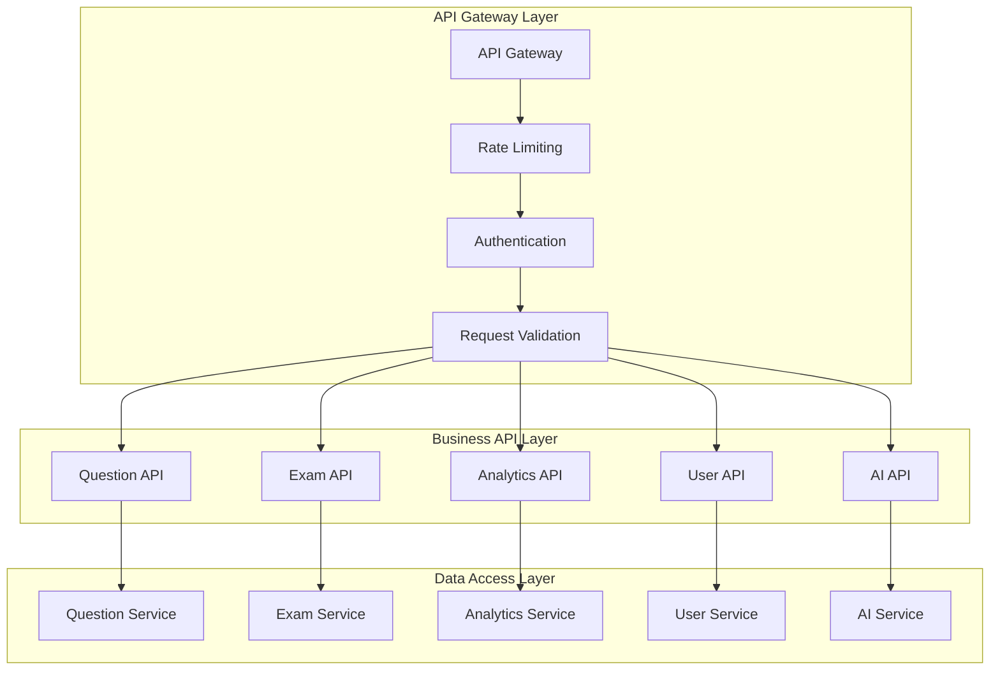

### API Endpoints Specification

#### Authentication Endpoints
```javascript
// Authentication & User Management
POST   /api/auth/register          // User registration
POST   /api/auth/login             // User login
POST   /api/auth/logout            // User logout
GET    /api/auth/profile           // Get user profile
PUT    /api/auth/profile           // Update user profile
DELETE /api/auth/account           // Delete user account
```

#### Question Management Endpoints
```javascript
// Question Management
GET    /api/questions              // Get questions with filters
POST   /api/questions              // Create new question
GET    /api/questions/:id          // Get specific question
PUT    /api/questions/:id          // Update question
DELETE /api/questions/:id          // Delete question
POST   /api/questions/bulk         // Bulk upload questions
GET    /api/questions/search       // Search questions
POST   /api/questions/generate     // AI generate questions

// Question Categories
GET    /api/questions/sections     // Get all sections
GET    /api/questions/topics       // Get topics by section
GET    /api/questions/difficulty   // Get questions by difficulty
```

#### Exam & Practice Endpoints
```javascript
// Practice Papers
GET    /api/papers                 // Get user's practice papers
POST   /api/papers                 // Create new practice paper
GET    /api/papers/:id             // Get specific paper
DELETE /api/papers/:id             // Delete practice paper
POST   /api/papers/generate        // Generate AI-based paper

// Exam Attempts
POST   /api/attempts               // Start new exam attempt
PUT    /api/attempts/:id           // Update attempt (answer question)
POST   /api/attempts/:id/submit    // Submit complete attempt
GET    /api/attempts/:id/results   // Get attempt results
GET    /api/attempts/history       // Get attempt history
```

#### Analytics & Performance Endpoints
```javascript
// Performance Analytics
GET    /api/analytics/dashboard    // Get performance dashboard
GET    /api/analytics/performance  // Detailed performance analysis
GET    /api/analytics/weak-areas   // Identify weak areas
GET    /api/analytics/predictions  // Score predictions
GET    /api/analytics/trends       // Performance trends
POST   /api/analytics/insights     // Generate AI insights

// Progress Tracking
GET    /api/progress/overview      // Overall progress summary
GET    /api/progress/section/:name // Section-wise progress
GET    /api/progress/daily         // Daily progress tracking
GET    /api/progress/goals         // Goal tracking
POST   /api/progress/goals         // Set new goals
```

#### AI & Content Endpoints
```javascript
// AI Services
POST   /api/ai/generate-question   // Generate single question
POST   /api/ai/generate-paper      // Generate practice paper
POST   /api/ai/explain-answer      // Generate answer explanation
POST   /api/ai/study-plan          // Generate study plan
POST   /api/ai/recommendations     // Get AI recommendations

// Current Affairs
GET    /api/current-affairs        // Get current affairs
POST   /api/current-affairs        // Add current affair event
GET    /api/current-affairs/quiz   // Generate current affairs quiz
GET    /api/current-affairs/daily  // Daily current affairs digest
```

### API Response Standards

```javascript
// Success Response Format
{
  "success": true,
  "data": {
    // Response data
  },
  "message": "Operation completed successfully",
  "timestamp": "2025-07-29T10:30:00Z",
  "requestId": "req_12345"
}

// Error Response Format
{
  "success": false,
  "error": {
    "code": "VALIDATION_ERROR",
    "message": "Invalid input parameters",
    "details": {
      "field": "email",
      "issue": "Invalid email format"
    }
  },
  "timestamp": "2025-07-29T10:30:00Z",
  "requestId": "req_12345"
}

// Pagination Response Format
{
  "success": true,
  "data": {
    "items": [...],
    "pagination": {
      "page": 1,
      "limit": 20,
      "total": 500,
      "totalPages": 25,
      "hasNext": true,
      "hasPrev": false
    }
  }
}
```

---

## 🎨 FRONTEND ARCHITECTURE

### React Component Architecture

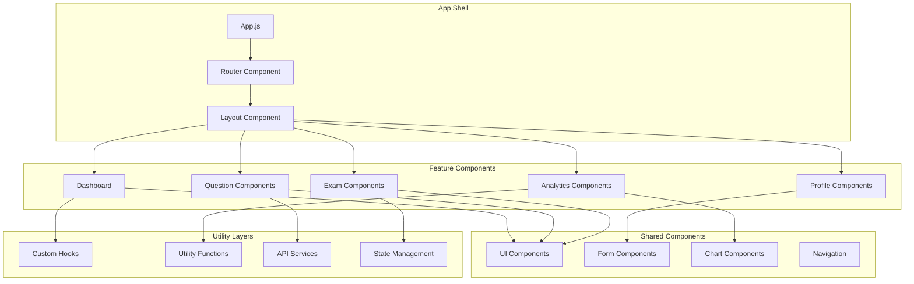

### Component Structure

```
src/
├── components/
│   ├── ui/                     # Reusable UI components
│   │   ├── Button.jsx
│   │   ├── Card.jsx
│   │   ├── Modal.jsx
│   │   ├── Timer.jsx
│   │   └── ProgressBar.jsx
│   ├── forms/                  # Form components
│   │   ├── QuestionForm.jsx
│   │   ├── ProfileForm.jsx
│   │   └── LoginForm.jsx
│   ├── charts/                 # Data visualization
│   │   ├── PerformanceChart.jsx
│   │   ├── TrendChart.jsx
│   │   └── ScoreChart.jsx
│   └── navigation/             # Navigation components
│       ├── Navbar.jsx
│       ├── Sidebar.jsx
│       └── Breadcrumb.jsx
├── features/
│   ├── dashboard/              # Dashboard feature
│   │   ├── Dashboard.jsx
│   │   ├── DashboardStats.jsx
│   │   └── RecentActivity.jsx
│   ├── questions/              # Question management
│   │   ├── QuestionList.jsx
│   │   ├── QuestionDetail.jsx
│   │   ├── QuestionGenerator.jsx
│   │   └── QuestionEditor.jsx
│   ├── exam/                   # Exam interface
│   │   ├── ExamInterface.jsx
│   │   ├── QuestionPaper.jsx
│   │   ├── ExamTimer.jsx
│   │   ├── ExamResults.jsx
│   │   └── ExamHistory.jsx
│   ├── analytics/              # Performance analytics
│   │   ├── AnalyticsDashboard.jsx
│   │   ├── PerformanceAnalysis.jsx
│   │   ├── WeakAreaAnalysis.jsx
│   │   └── ScorePrediction.jsx
│   └── profile/                # User profile
│       ├── ProfilePage.jsx
│       ├── Settings.jsx
│       └── StudySchedule.jsx
├── hooks/                      # Custom React hooks
│   ├── useAuth.js
│   ├── useExamTimer.js
│   ├── useQuestions.js
│   ├── useAnalytics.js
│   └── useLocalStorage.js
├── services/                   # API services
│   ├── api.js
│   ├── questionService.js
│   ├── examService.js
│   ├── analyticsService.js
│   ├── aiService.js
│   └── authService.js
├── store/                      # State management
│   ├── index.js
│   ├── authStore.js
│   ├── examStore.js
│   ├── questionStore.js
│   └── analyticsStore.js
├── utils/                      # Utility functions
│   ├── constants.js
│   ├── helpers.js
│   ├── validators.js
│   ├── formatters.js
│   └── calculations.js
└── styles/                     # Styling
    ├── globals.css
    ├── components.css
    └── utilities.css
```

### State Management Architecture

```javascript
// Zustand Store Structure
const useExamStore = create((set, get) => ({
  // State
  currentExam: null,
  questions: [],
  currentQuestionIndex: 0,
  answers: {},
  timeRemaining: 3600,
  isExamActive: false,
  
  // Actions
  startExam: (examConfig) => set({ 
    isExamActive: true, 
    currentExam: examConfig,
    timeRemaining: examConfig.duration 
  }),
  
  submitAnswer: (questionId, answer) => set((state) => ({
    answers: { ...state.answers, [questionId]: answer }
  })),
  
  nextQuestion: () => set((state) => ({
    currentQuestionIndex: Math.min(
      state.currentQuestionIndex + 1,
      state.questions.length - 1
    )
  })),
  
  finishExam: () => set({ 
    isExamActive: false,
    currentExam: null 
  })
}));

// Performance Analytics Store
const useAnalyticsStore = create((set, get) => ({
  // State
  performance: {},
  weakAreas: [],
  predictions: {},
  trends: [],
  
  // Actions
  updatePerformance: (sectionData) => set((state) => ({
    performance: { ...state.performance, ...sectionData }
  })),
  
  identifyWeakAreas: () => {
    const { performance } = get();
    const weakAreas = Object.entries(performance)
      .filter(([section, data]) => data.accuracy < 0.6)
      .map(([section]) => section);
    set({ weakAreas });
  },
  
  generatePredictions: async () => {
    const { performance } = get();
    const predictions = await calculateScorePrediction(performance);
    set({ predictions });
  }
}));
```

---

## ⚙️ BACKEND ARCHITECTURE

### Node.js Server Architecture

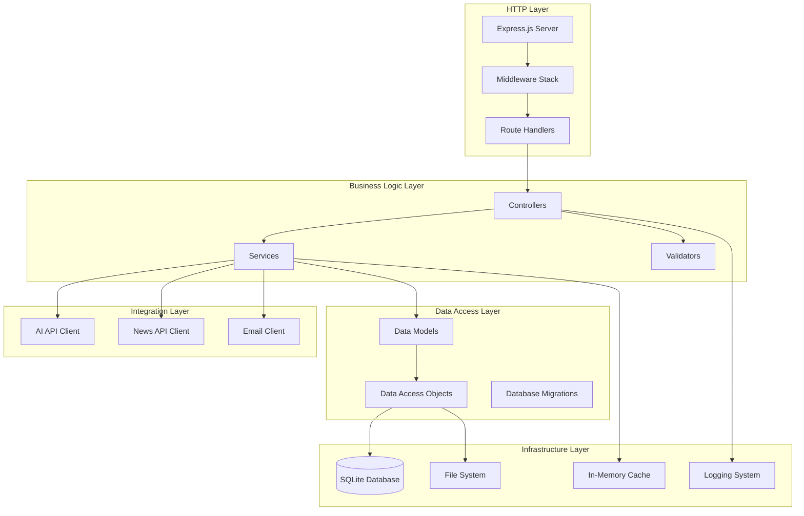

### Server Directory Structure

```
server/
├── src/
│   ├── controllers/            # Request handlers
│   │   ├── authController.js
│   │   ├── questionController.js
│   │   ├── examController.js
│   │   ├── analyticsController.js
│   │   └── aiController.js
│   ├── services/               # Business logic
│   │   ├── authService.js
│   │   ├── questionService.js
│   │   ├── examService.js
│   │   ├── analyticsService.js
│   │   ├── aiService.js
│   │   └── emailService.js
│   ├── models/                 # Data models
│   │   ├── User.js
│   │   ├── Question.js
│   │   ├── Exam.js
│   │   ├── Attempt.js
│   │   └── Analytics.js
│   ├── dao/                    # Data access layer
│   │   ├── BaseDAO.js
│   │   ├── UserDAO.js
│   │   ├── QuestionDAO.js
│   │   ├── ExamDAO.js
│   │   └── AnalyticsDAO.js
│   ├── middleware/             # Express middleware
│   │   ├── auth.js
│   │   ├── validation.js
│   │   ├── rateLimit.js
│   │   ├── cors.js
│   │   └── errorHandler.js
│   ├── routes/                 # API routes
│   │   ├── auth.js
│   │   ├── questions.js
│   │   ├── exams.js
│   │   ├── analytics.js
│   │   └── ai.js
│   ├── utils/                  # Utility functions
│   │   ├── database.js
│   │   ├── logger.js
│   │   ├── validators.js
│   │   ├── helpers.js
│   │   └── constants.js
│   ├── config/                 # Configuration
│   │   ├── database.js
│   │   ├── server.js
│   │   ├── ai.js
│   │   └── external-apis.js
│   └── migrations/             # Database migrations
│       ├── 001_initial_schema.sql
│       ├── 002_add_analytics.sql
│       └── 003_add_current_affairs.sql
├── tests/                      # Test files
│   ├── unit/
│   ├── integration/
│   └── fixtures/
├── docs/                       # API documentation
└── scripts/                    # Utility scripts
```

### Service Layer Implementation Example

```javascript
// questionService.js
class QuestionService {
  constructor(questionDAO, aiService, cacheManager) {
    this.questionDAO = questionDAO;
    this.aiService = aiService;
    this.cache = cacheManager;
  }

  async generateQuestion(section, topic, difficulty) {
    const cacheKey = `generated_question_${section}_${topic}_${difficulty}`;
    
    // Check cache first
    let question = await this.cache.get(cacheKey);
    if (question) return question;

    // Generate using AI
    const prompt = this.buildQuestionPrompt(section, topic, difficulty);
    const aiResponse = await this.aiService.generateQuestion(prompt);
    
    // Validate and process
    question = this.validateAndProcessQuestion(aiResponse, section, topic);
    
    // Store in database
    const savedQuestion = await this.questionDAO.create(question);
    
    // Cache for future use
    await this.cache.set(cacheKey, savedQuestion, 3600); // 1 hour
    
    return savedQuestion;
  }

  async getQuestionsByPattern(filters) {
    const { section, topic, difficulty, limit = 20, offset = 0 } = filters;
    
    return await this.questionDAO.findByPattern({
      section,
      topic,
      difficulty,
      limit,
      offset
    });
  }

  async analyzeQuestionPatterns(timeframe = '12months') {
    const questions = await this.questionDAO.getHistoricalQuestions(timeframe);
    
    return {
      sectionDistribution: this.calculateSectionDistribution(questions),
      topicFrequency: this.calculateTopicFrequency(questions),
      difficultyTrends: this.calculateDifficultyTrends(questions),
      recommendations: this.generatePatternRecommendations(questions)
    };
  }

  buildQuestionPrompt(section, topic, difficulty) {
    const templates = {
      current_affairs: `Generate a current affairs MCQ about ${topic} with difficulty level ${difficulty}...`,
      numerical_aptitude: `Create a numerical aptitude question on ${topic} with difficulty ${difficulty}...`,
      // ... other templates
    };
    
    return templates[section] || templates.default;
  }

  validateAndProcessQuestion(aiResponse, section, topic) {
    // Parse AI response
    const parsedQuestion = JSON.parse(aiResponse);
    
    // Validate structure
    if (!this.isValidQuestionStructure(parsedQuestion)) {
      throw new Error('Invalid question structure from AI');
    }
    
    // Add metadata
    return {
      ...parsedQuestion,
      section,
      topic,
      confidence_score: 0.8,
      created_at: new Date().toISOString(),
      source: 'ai_generated'
    };
  }
}
```

---

## 🔐 SECURITY ARCHITECTURE

### Security Layers

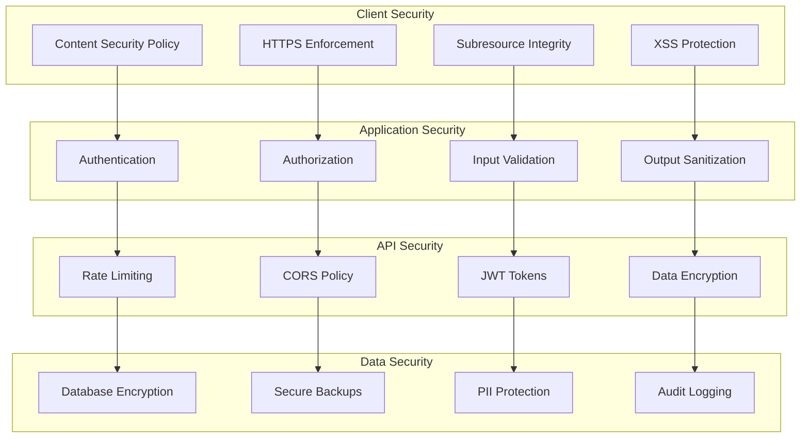

### Security Implementation

```javascript
// Authentication & Authorization
const authMiddleware = {
  // JWT token validation
  validateToken: (req, res, next) => {
    const token = req.headers.authorization?.split(' ')[1];
    
    try {
      const decoded = jwt.verify(token, process.env.JWT_SECRET);
      req.user = decoded;
      next();
    } catch (error) {
      return res.status(401).json({ error: 'Invalid token' });
    }
  },

  // Rate limiting per user
  createRateLimit: (maxRequests = 100, windowMs = 15 * 60 * 1000) => {
    return rateLimit({
      windowMs,
      max: maxRequests,
      keyGenerator: (req) => req.user?.id || req.ip,
      message: 'Too many requests from this user'
    });
  }
};

// Input validation and sanitization
const validationMiddleware = {
  validateQuestionInput: [
    body('question_text').isLength({ min: 10, max: 1000 }).trim().escape(),
    body('options').isObject().custom((options) => {
      const keys = Object.keys(options);
      return keys.length === 4 && keys.every(key => ['A', 'B', 'C', 'D'].includes(key));
    }),
    body('correct_answer').isIn(['A', 'B', 'C', 'D']),
    body('difficulty_level').isInt({ min: 1, max: 5 })
  ],

  validateExamAttempt: [
    body('answers').isObject(),
    body('timeSpent').isInt({ min: 0, max: 7200 }), // Max 2 hours
    body('paperId').isInt()
  ]
};

// Data encryption utilities
const encryptionUtils = {
  encryptSensitiveData: (data) => {
    const algorithm = 'aes-256-gcm';
    const key = Buffer.from(process.env.ENCRYPTION_KEY, 'hex');
    const iv = crypto.randomBytes(16);
    
    const cipher = crypto.createCipher(algorithm, key);
    cipher.setAAD(Buffer.from('additional_data'));
    
    let encrypted = cipher.update(JSON.stringify(data), 'utf8', 'hex');
    encrypted += cipher.final('hex');
    
    const authTag = cipher.getAuthTag();
    
    return {
      encrypted,
      iv: iv.toString('hex'),
      authTag: authTag.toString('hex')
    };
  },

  decryptSensitiveData: (encryptedData) => {
    const algorithm = 'aes-256-gcm';
    const key = Buffer.from(process.env.ENCRYPTION_KEY, 'hex');
    
    const decipher = crypto.createDecipher(algorithm, key);
    decipher.setAAD(Buffer.from('additional_data'));
    decipher.setAuthTag(Buffer.from(encryptedData.authTag, 'hex'));
    
    let decrypted = decipher.update(encryptedData.encrypted, 'hex', 'utf8');
    decrypted += decipher.final('utf8');
    
    return JSON.parse(decrypted);
  }
};
```

---

## 🔗 INTEGRATION ARCHITECTURE

### External API Integration

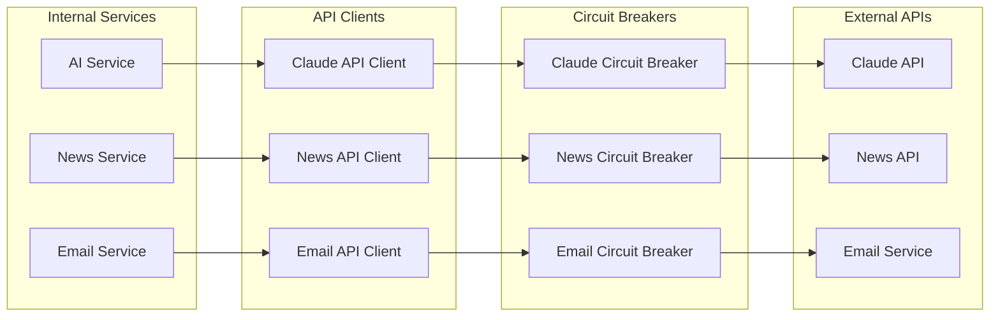

### API Client Implementation

```javascript
// AI Service Client with Circuit Breaker
class ClaudeAPIClient {
  constructor() {
    this.baseURL = 'https://api.anthropic.com/v1';
    this.circuitBreaker = new CircuitBreaker(this.makeRequest.bind(this), {
      timeout: 30000,
      errorThresholdPercentage: 50,
      resetTimeout: 60000
    });
  }

  async generateQuestion(prompt, section) {
    const requestBody = {
      model: 'claude-sonnet-4-20250514',
      max_tokens: 1000,
      messages: [
        {
          role: 'user',
          content: this.buildQuestionPrompt(prompt, section)
        }
      ]
    };

    try {
      const response = await this.circuitBreaker.fire(requestBody);
      return this.parseQuestionResponse(response.content[0].text);
    } catch (error) {
      console.error('Claude API error:', error);
      return this.getFallbackQuestion(section);
    }
  }

  async makeRequest(requestBody) {
    const response = await fetch(`${this.baseURL}/messages`, {
      method: 'POST',
      headers: {
        'Content-Type': 'application/json',
        'x-api-key': process.env.CLAUDE_API_KEY
      },
      body: JSON.stringify(requestBody)
    });

    if (!response.ok) {
      throw new Error(`Claude API error: ${response.status}`);
    }

    return await response.json();
  }

  buildQuestionPrompt(prompt, section) {
    const templates = {
      current_affairs: `
        Generate a multiple choice question about current affairs with the following specifications:
        Topic: ${prompt}
        
        Return ONLY a valid JSON object with this structure:
        {
          "question_text": "Question text here",
          "options": {
            "A": "Option A text",
            "B": "Option B text", 
            "C": "Option C text",
            "D": "Option D text"
          },
          "correct_answer": "A",
          "explanation": "Detailed explanation of the correct answer",
          "difficulty_level": 2,
          "topic": "${prompt}"
        }
        
        Make sure the question is factually accurate and the distractors are plausible but clearly incorrect.
      `,
      // ... other section templates
    };

    return templates[section] || templates.current_affairs;
  }

  parseQuestionResponse(response) {
    try {
      // Clean response (remove code blocks if present)
      const cleanResponse = response.replace(/```json\n?|\n?```/g, '').trim();
      const question = JSON.parse(cleanResponse);
      
      // Validate structure
      if (!this.validateQuestionStructure(question)) {
        throw new Error('Invalid question structure');
      }
      
      return question;
    } catch (error) {
      console.error('Error parsing Claude response:', error);
      throw new Error('Failed to parse AI-generated question');
    }
  }

  validateQuestionStructure(question) {
    const required = ['question_text', 'options', 'correct_answer', 'explanation'];
    return required.every(field => question.hasOwnProperty(field)) &&
           Object.keys(question.options).length === 4 &&
           ['A', 'B', 'C', 'D'].includes(question.correct_answer);
  }

  getFallbackQuestion(section) {
    // Return a predefined question when AI fails
    const fallbackQuestions = {
      current_affairs: {
        question_text: "Which organization releases the World Economic Outlook report?",
        options: {
          A: "World Bank",
          B: "International Monetary Fund",
          C: "World Trade Organization", 
          D: "United Nations"
        },
        correct_answer: "B",
        explanation: "The International Monetary Fund (IMF) releases the World Economic Outlook report twice a year.",
        difficulty_level: 2,
        topic: "International Organizations"
      }
      // ... other fallback questions
    };
    
    return fallbackQuestions[section];
  }
}

// News API Client
class NewsAPIClient {
  constructor() {
    this.baseURL = 'https://newsapi.org/v2';
    this.apiKey = process.env.NEWS_API_KEY;
  }

  async getCurrentAffairs(days = 30) {
    const fromDate = new Date(Date.now() - days * 24 * 60 * 60 * 1000)
      .toISOString().split('T')[0];
    
    const sources = 'the-hindu,indian-express,bbc-news,reuters';
    
    try {
      const response = await fetch(
        `${this.baseURL}/everything?sources=${sources}&from=${fromDate}&language=en&sortBy=relevancy`,
        {
          headers: {
            'X-API-Key': this.apiKey
          }
        }
      );
      
      const data = await response.json();
      return this.processNewsArticles(data.articles);
    } catch (error) {
      console.error('News API error:', error);
      return [];
    }
  }

  processNewsArticles(articles) {
    return articles
      .filter(article => this.isRelevantForExam(article))
      .map(article => ({
        title: article.title,
        description: article.description,
        url: article.url,
        publishedAt: article.publishedAt,
        source: article.source.name,
        category: this.categorizeNews(article),
        importance: this.calculateImportance(article)
      }));
  }

  isRelevantForExam(article) {
    const keywords = [
      'government', 'policy', 'scheme', 'budget', 'economy',
      'election', 'appointment', 'award', 'treaty', 'summit',
      'india', 'ministry', 'parliament', 'supreme court'
    ];
    
    const text = (article.title + ' ' + article.description).toLowerCase();
    return keywords.some(keyword => text.includes(keyword));
  }

  categorizeNews(article) {
    const categories = {
      'Political': ['government', 'election', 'parliament', 'minister'],
      'Economic': ['economy', 'budget', 'gdp', 'inflation', 'market'],
      'International': ['treaty', 'summit', 'foreign', 'bilateral'],
      'Awards': ['award', 'prize', 'honor', 'recognition'],
      'Appointments': ['appointment', 'resign', 'elected', 'nominated']
    };
    
    const text = (article.title + ' ' + article.description).toLowerCase();
    
    for (const [category, keywords] of Object.entries(categories)) {
      if (keywords.some(keyword => text.includes(keyword))) {
        return category;
      }
    }
    
    return 'General';
  }

  calculateImportance(article) {
    let score = 5; // Base score
    
    // Boost for government/official sources
    if (article.source.name.includes('PIB') || 
        article.source.name.includes('Government')) {
      score += 3;
    }
    
    // Boost for major national newspapers
    if (['The Hindu', 'Indian Express'].includes(article.source.name)) {
      score += 2;
    }
    
    // Boost for keywords indicating importance
    const highImportanceKeywords = ['prime minister', 'president', 'supreme court', 'budget'];
    const text = (article.title + ' ' + article.description).toLowerCase();
    if (highImportanceKeywords.some(keyword => text.includes(keyword))) {
      score += 2;
    }
    
    return Math.min(score, 10); // Cap at 10
  }
}
```

---

## 🚀 DEPLOYMENT ARCHITECTURE

### Cloud Deployment Strategy

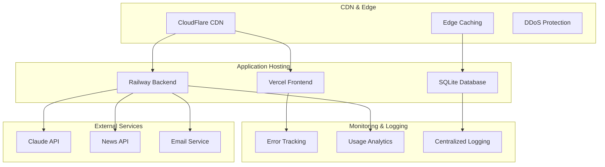

### Infrastructure Configuration

```yaml
# vercel.json - Frontend deployment
{
  "version": 2,
  "builds": [
    {
      "src": "package.json",
      "use": "@vercel/static-build",
      "config": {
        "distDir": "build"
      }
    }
  ],
  "routes": [
    {
      "src": "/static/(.*)",
      "headers": {
        "cache-control": "public, max-age=31536000, immutable"
      }
    },
    {
      "src": "/(.*)",
      "dest": "/index.html"
    }
  ],
  "env": {
    "REACT_APP_API_URL": "@api_url",
    "REACT_APP_ENV": "production"
  }
}

# railway.json - Backend deployment
{
  "build": {
    "builder": "NIXPACKS"
  },
  "deploy": {
    "startCommand": "npm start",
    "healthcheckPath": "/health"
  }
}

# Environment Configuration
production.env:
NODE_ENV=production
PORT=3001
DATABASE_URL=file:./data/production.db
CLAUDE_API_KEY=${CLAUDE_API_KEY}
NEWS_API_KEY=${NEWS_API_KEY}
JWT_SECRET=${JWT_SECRET}
ENCRYPTION_KEY=${ENCRYPTION_KEY}
CORS_ORIGIN=https://ib-acio-prep.vercel.app
RATE_LIMIT_WINDOW=900000
RATE_LIMIT_MAX=100
```

### Deployment Pipeline

```javascript
// GitHub Actions Workflow
name: 'Deploy IB ACIO Prep System'

on:
  push:
    branches: [main]
  pull_request:
    branches: [main]

jobs:
  test:
    runs-on: ubuntu-latest
    steps:
      - uses: actions/checkout@v3
      - uses: actions/setup-node@v3
        with:
          node-version: '18'
      - run: npm ci
      - run: npm run test
      - run: npm run lint

  deploy-frontend:
    needs: test
    runs-on: ubuntu-latest
    steps:
      - uses: actions/checkout@v3
      - name: Deploy to Vercel
        uses: amondnet/vercel-action@v20
        with:
          vercel-token: ${{ secrets.VERCEL_TOKEN }}
          vercel-org-id: ${{ secrets.ORG_ID }}
          vercel-project-id: ${{ secrets.PROJECT_ID }}

  deploy-backend:
    needs: test
    runs-on: ubuntu-latest
    steps:
      - uses: actions/checkout@v3
      - name: Deploy to Railway
        uses: bervProject/railway-deploy@v1.1.0
        with:
          railway_token: ${{ secrets.RAILWAY_TOKEN }}
          service: 'ib-acio-backend'
```

---

## 📊 PERFORMANCE ARCHITECTURE

### Performance Optimization Strategy

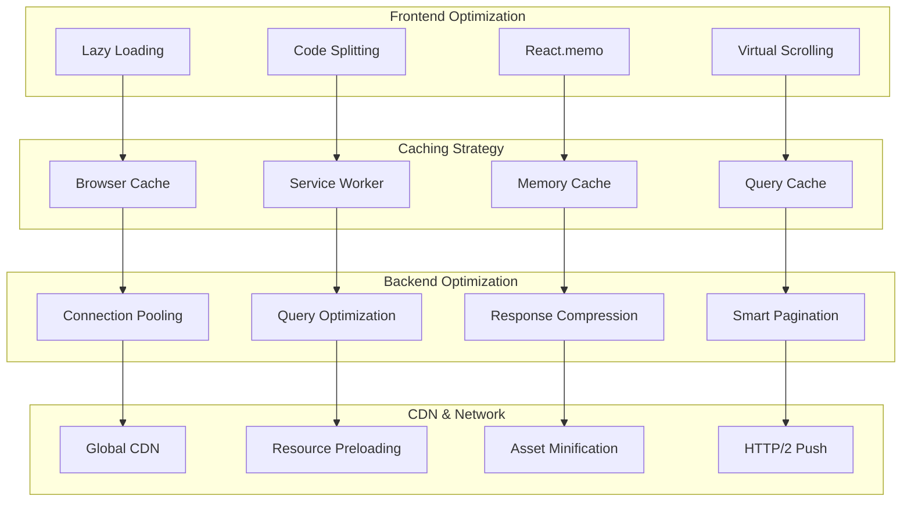

### Performance Optimization Implementation

```javascript
// Frontend Performance Optimizations

// 1. Code Splitting with React.lazy
const Dashboard = React.lazy(() => import('./features/dashboard/Dashboard'));
const ExamInterface = React.lazy(() => import('./features/exam/ExamInterface'));
const Analytics = React.lazy(() => import('./features/analytics/AnalyticsDashboard'));

function App() {
  return (
    <Router>
      <Suspense fallback={<LoadingSpinner />}>
        <Routes>
          <Route path="/dashboard" element={<Dashboard />} />
          <Route path="/exam" element={<ExamInterface />} />
          <Route path="/analytics" element={<Analytics />} />
        </Routes>
      </Suspense>
    </Router>
  );
}

// 2. Memoization for Heavy Components
const QuestionList = React.memo(({ questions, onQuestionSelect }) => {
  const sortedQuestions = useMemo(() => 
    questions.sort((a, b) => b.difficulty_level - a.difficulty_level),
    [questions]
  );

  return (
    <VirtualizedList
      items={sortedQuestions}
      renderItem={({ item }) => (
        <QuestionCard 
          key={item.id} 
          question={item} 
          onClick={() => onQuestionSelect(item.id)} 
        />
      )}
      height={400}
    />
  );
});

// 3. Custom Hooks for Data Fetching with Cache
const useQuestions = (section, topic) => {
  const [data, setData] = useState(null);
  const [loading, setLoading] = useState(true);
  const [error, setError] = useState(null);

  useEffect(() => {
    const cacheKey = `questions_${section}_${topic}`;
    
    // Check cache first
    const cached = sessionStorage.getItem(cacheKey);
    if (cached) {
      setData(JSON.parse(cached));
      setLoading(false);
      return;
    }

    // Fetch from API
    fetchQuestions(section, topic)
      .then(questions => {
        setData(questions);
        sessionStorage.setItem(cacheKey, JSON.stringify(questions));
      })
      .catch(setError)
      .finally(() => setLoading(false));
  }, [section, topic]);

  return { data, loading, error };
};

// Backend Performance Optimizations

// 1. Database Query Optimization
class QuestionDAO {
  constructor(db) {
    this.db = db;
    this.cache = new Map();
  }

  async findBySection(section, limit = 20, offset = 0) {
    const cacheKey = `section_${section}_${limit}_${offset}`;
    
    // Check memory cache
    if (this.cache.has(cacheKey)) {
      return this.cache.get(cacheKey);
    }

    // Optimized query with indexes
    const query = `
      SELECT q.*, 
             COUNT(ua.attempt_id) as attempt_count,
             AVG(CASE WHEN ua.is_correct THEN 1.0 ELSE 0.0 END) as success_rate
      FROM questions q
      LEFT JOIN user_attempts ua ON q.question_id = ua.question_id
      WHERE q.section = ?
      GROUP BY q.question_id
      ORDER BY q.difficulty_level, q.created_at DESC
      LIMIT ? OFFSET ?
    `;

    const questions = await this.db.all(query, [section, limit, offset]);
    
    // Cache for 5 minutes
    this.cache.set(cacheKey, questions);
    setTimeout(() => this.cache.delete(cacheKey), 5 * 60 * 1000);
    
    return questions;
  }

  async getQuestionPatterns() {
    // Use prepared statement for better performance
    const stmt = this.db.prepare(`
      SELECT 
        section,
        topic,
        difficulty_level,
        COUNT(*) as count,
        AVG(confidence_score) as avg_confidence
      FROM questions 
      WHERE created_at > datetime('now', '-1 year')
      GROUP BY section, topic, difficulty_level
      ORDER BY count DESC
    `);
    
    return stmt.all();
  }
}

// 2. Response Compression and Caching
const app = express();

app.use(compression({
  level: 6,
  threshold: 1024,
  filter: (req, res) => {
    if (req.headers['x-no-compression']) return false;
    return compression.filter(req, res);
  }
}));

app.use('/api/questions', (req, res, next) => {
  // Set cache headers for question data
  res.set({
    'Cache-Control': 'public, max-age=300', // 5 minutes
    'ETag': generateETag(req.url)
  });
  next();
});

// 3. Connection Pooling (if moving to PostgreSQL later)
const pool = new Pool({
  connectionString: process.env.DATABASE_URL,
  max: 20,
  idleTimeoutMillis: 30000,
  connectionTimeoutMillis: 2000,
});
```

---

## 🔧 TECHNOLOGY STACK

### Complete Technology Specification

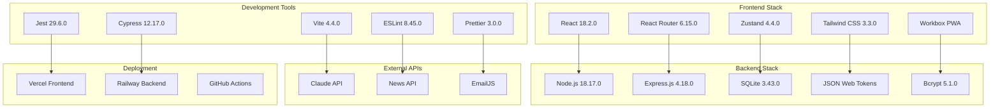

### Package.json Dependencies

```json
{
  "name": "ib-acio-prep-frontend",
  "version": "1.0.0",
  "dependencies": {
    "react": "^18.2.0",
    "react-dom": "^18.2.0",
    "react-router-dom": "^6.15.0",
    "zustand": "^4.4.0",
    "@headlessui/react": "^1.7.17",
    "@heroicons/react": "^2.0.18",
    "framer-motion": "^10.16.4",
    "recharts": "^2.8.0",
    "date-fns": "^2.30.0",
    "axios": "^1.5.0",
    "react-hot-toast": "^2.4.1",
    "react-confetti": "^6.1.0",
    "workbox-webpack-plugin": "^6.6.0"
  },
  "devDependencies": {
    "@vitejs/plugin-react": "^4.0.3",
    "vite": "^4.4.5",
    "tailwindcss": "^3.3.0",
    "autoprefixer": "^10.4.14",
    "postcss": "^8.4.27",
    "eslint": "^8.45.0",
    "prettier": "^3.0.0",
    "@testing-library/react": "^13.4.0",
    "@testing-library/jest-dom": "^5.17.0",
    "cypress": "^12.17.0"
  }
}

{
  "name": "ib-acio-prep-backend",
  "version": "1.0.0",
  "dependencies": {
    "express": "^4.18.2",
    "sqlite3": "^5.1.6",
    "cors": "^2.8.5",
    "helmet": "^7.0.0",
    "compression": "^1.7.4",
    "express-rate-limit": "^6.10.0",
    "jsonwebtoken": "^9.0.2",
    "bcryptjs": "^2.4.3",
    "express-validator": "^7.0.1",
    "axios": "^1.5.0",
    "node-cron": "^3.0.2",
    "winston": "^3.10.0",
    "dotenv": "^16.3.1"
  },
  "devDependencies": {
    "nodemon": "^3.0.1",
    "jest": "^29.6.2",
    "supertest": "^6.3.3",
    "eslint": "^8.45.0"
  }
}
```

---

## 🌊 DATA FLOW DIAGRAMS

### Question Generation Flow

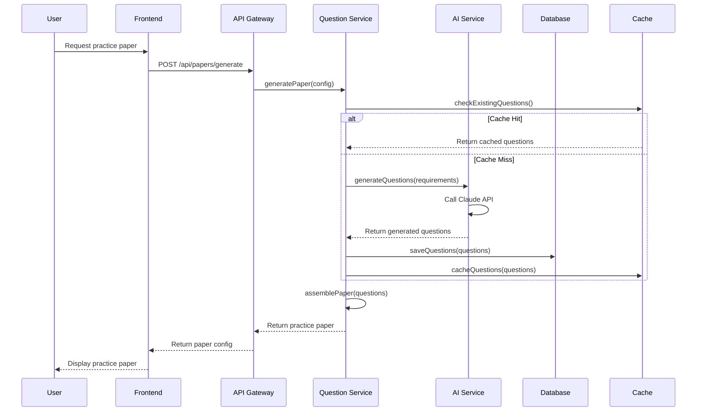

### Exam Attempt Flow

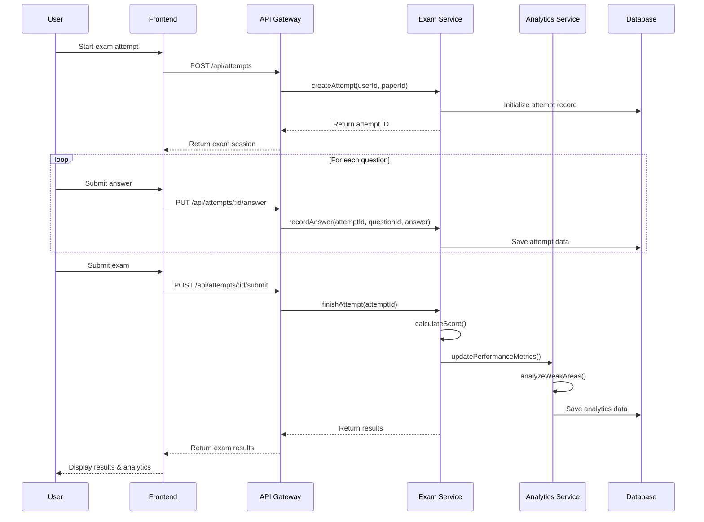

### Performance Analytics Flow

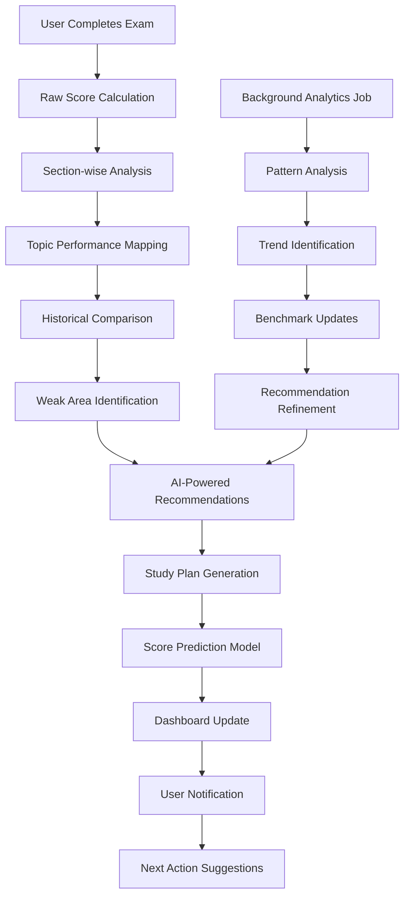

---

## 📈 SCALABILITY CONSIDERATIONS

### Horizontal Scaling Strategy

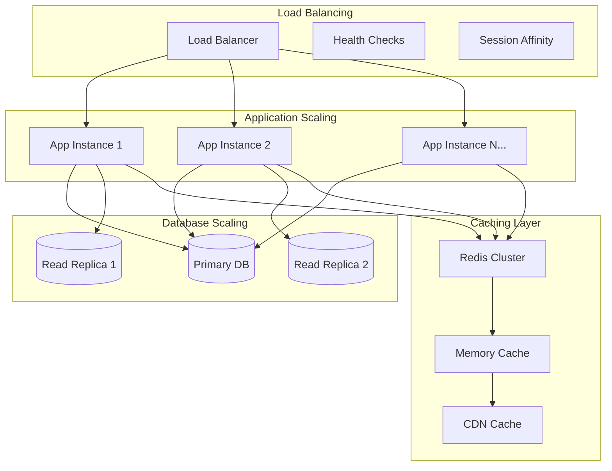

### Scaling Implementation Plan

```javascript
// Database Connection Pooling
class DatabaseManager {
  constructor() {
    this.primaryDB = new Database('./data/primary.db');
    this.readReplicas = [
      new Database('./data/replica1.db'),
      new Database('./data/replica2.db')
    ];
    this.writePool = this.createConnectionPool(this.primaryDB, 10);
    this.readPools = this.readReplicas.map(db => 
      this.createConnectionPool(db, 5)
    );
  }

  async executeRead(query, params) {
    const replica = this.getHealthyReplica();
    const pool = this.readPools[replica];
    return await pool.get(query, params);
  }

  async executeWrite(query, params) {
    return await this.writePool.run(query, params);
  }

  getHealthyReplica() {
    // Simple round-robin, can be enhanced with health checks
    return Math.floor(Math.random() * this.readReplicas.length);
  }
}

// Microservices Architecture Preparation
const serviceRegistry = {
  questionService: {
    instances: [
      'http://questions-1.service.local:3001',
      'http://questions-2.service.local:3001'
    ],
    healthCheck: '/health'
  },
  analyticsService: {
    instances: [
      'http://analytics-1.service.local:3002',
      'http://analytics-2.service.local:3002'
    ],
    healthCheck: '/health'
  }
};

class ServiceDiscovery {
  async getHealthyInstance(serviceName) {
    const service = serviceRegistry[serviceName];
    
    for (const instance of service.instances) {
      try {
        const health = await fetch(`${instance}${service.healthCheck}`);
        if (health.ok) return instance;
      } catch (error) {
        continue; // Try next instance
      }
    }
    
    throw new Error(`No healthy instances for ${serviceName}`);
  }
}

// Auto-scaling Configuration
const scalingRules = {
  scaleUp: {
    cpuThreshold: 70,
    memoryThreshold: 80,
    responseTimeThreshold: 2000,
    errorRateThreshold: 5
  },
  scaleDown: {
    cpuThreshold: 30,
    memoryThreshold: 40,
    responseTimeThreshold: 500,
    errorRateThreshold: 1
  },
  cooldownPeriod: 300 // 5 minutes
};
```

---

## 🎯 PERFORMANCE TARGETS

### Key Performance Indicators

| Metric | Target | Measurement Method |
|--------|--------|-------------------|
| **Page Load Time** | < 2 seconds | Lighthouse CI |
| **API Response Time** | < 500ms | Application monitoring |
| **Database Query Time** | < 100ms | Query profiling |
| **Time to Interactive** | < 3 seconds | Core Web Vitals |
| **Largest Contentful Paint** | < 2.5 seconds | Web Vitals |
| **Cumulative Layout Shift** | < 0.1 | Web Vitals |
| **First Input Delay** | < 100ms | Web Vitals |
| **AI Response Time** | < 10 seconds | Custom monitoring |
| **Offline Capability** | 100% core features | PWA audit |
| **Mobile Performance** | 90+ Lighthouse score | Mobile audit |

### Monitoring Implementation

```javascript
// Performance Monitoring Setup
class PerformanceMonitor {
  constructor() {
    this.metrics = new Map();
    this.thresholds = {
      apiResponse: 500,
      dbQuery: 100,
      pageLoad: 2000
    };
  }

  startTimer(operation) {
    const startTime = performance.now();
    return () => {
      const duration = performance.now() - startTime;
      this.recordMetric(operation, duration);
      return duration;
    };
  }

  recordMetric(operation, duration) {
    if (!this.metrics.has(operation)) {
      this.metrics.set(operation, []);
    }
    
    this.metrics.get(operation).push({
      duration,
      timestamp: Date.now()
    });

    // Alert if threshold exceeded
    if (duration > this.thresholds[operation]) {
      this.sendAlert(operation, duration);
    }
  }

  sendAlert(operation, duration) {
    console.warn(`Performance alert: ${operation} took ${duration}ms`);
    // Send to monitoring service
  }

  getAverageTime(operation, timeWindow = 3600000) { // 1 hour
    const now = Date.now();
    const metrics = this.metrics.get(operation) || [];
    const recentMetrics = metrics.filter(m => 
      now - m.timestamp < timeWindow
    );
    
    if (recentMetrics.length === 0) return 0;
    
    const sum = recentMetrics.reduce((acc, m) => acc + m.duration, 0);
    return sum / recentMetrics.length;
  }
}

// Usage in API routes
app.use('/api', (req, res, next) => {
  const timer = performanceMonitor.startTimer('apiResponse');
  
  res.on('finish', () => {
    const duration = timer();
    res.set('X-Response-Time', `${duration}ms`);
  });
  
  next();
});
```

---

## 🔄 DEVELOPMENT WORKFLOW

### Git Workflow Strategy

```mermaid
gitgraph
    commit id: "Initial Setup"
    branch develop
    checkout develop
    commit id: "Sprint 1: Foundation"
    branch feature/question-engine
    checkout feature/question-engine
    commit id: "Question parsing"
    commit id: "AI integration"
    checkout develop
    merge feature/question-engine
    branch feature/exam-interface
    checkout feature/exam-interface
    commit id: "Exam UI"
    commit id: "Timer logic"
    checkout develop
    merge feature/exam-interface
    checkout main
    merge develop
    commit id: "v1.0.0 Release"
```

### Code Quality Standards

```javascript
// ESLint Configuration
module.exports = {
  extends: [
    'react-app',
    'react-app/jest',
    'eslint:recommended',
    '@typescript-eslint/recommended'
  ],
  rules: {
    'no-unused-vars': 'error',
    'no-console': 'warn',
    'prefer-const': 'error',
    'react/prop-types': 'error',
    'react/no-unused-state': 'error',
    'react-hooks/exhaustive-deps': 'warn'
  }
};

// Prettier Configuration
module.exports = {
  semi: true,
  trailingComma: 'es5',
  singleQuote: true,
  printWidth: 80,
  tabWidth: 2,
  useTabs: false,
  bracketSpacing: true,
  arrowParens: 'avoid'
};

// Jest Testing Configuration
module.exports = {
  testEnvironment: 'jsdom',
  setupFilesAfterEnv: ['<rootDir>/src/setupTests.js'],
  moduleNameMapping: {
    '\\.(css|less|scss|sass)$': 'identity-obj-proxy'
  },
  collectCoverageFrom: [
    'src/**/*.{js,jsx}',
    '!src/index.js',
    '!src/reportWebVitals.js'
  ],
  coverageThreshold: {
    global: {
      branches: 80,
      functions: 80,
      lines: 80,
      statements: 80
    }
  }
};
```

---

This comprehensive software architecture provides a solid foundation for building your IB ACIO preparation system. The modular design allows for incremental development while maintaining scalability and performance standards.

**Next Steps:**
1. **Review Architecture**: Ensure all components align with your vision
2. **Set Up Development Environment**: Initialize project with this architecture
3. **Start with Sprint 1**: Begin implementing the foundation components
4. **Continuous Integration**: Set up the CI/CD pipeline early

**Ready to start coding? Which architectural component would you like to implement first?**